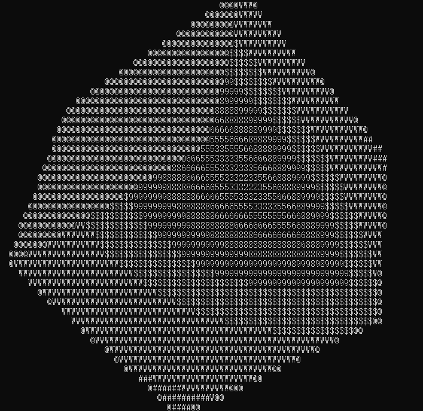

# 3D_shading_with_ascII

## Using only AscII characters to render a 3D cube with shading
---

### Get Started
make sure cmake is installed
- mkdir build
- cd build 
- cmake .. 
- cmake --build . 

### Features 

- using only c++ std library only, no 3rd party is needed
- compute Model View Projection matrix ,pretty standard graphic render pipline
- compute Rotation matrix with basic rotation x/y/z, then combine them to make complex cube spin
- using phong shading model with one point light source